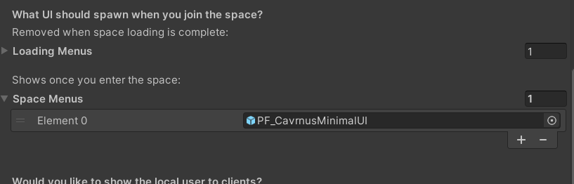

# CollaborationShowcase

**Initial Setup** Need an account? Refer to the Getting Started guide here:

> [Getting Started – Cavrnus Documentation](https://cavrnus.atlassian.net/wiki/spaces/CSM/pages/815269466/Getting+Started)

**Important:** Before building for your target platform, make sure to follow all required project setup steps.
> Refer to the official guide here:  
> [Required Project Settings – Cavrnus Documentation](https://cavrnus.atlassian.net/wiki/spaces/CSM/pages/845381657/Required+Project+Settings)

This demo scene highlights desktop collaboration features using 3D spatial UI and real-time data synchronization.

## Overview

The `CollaborationShowcase` scene is designed for desktop platforms and demonstrates how to interact with and bind data in a 3D space. It serves as a comprehensive reference for building interactive, shared experiences using Cavrnus components.

> For detailed guidance on using Cavrnus components, please refer to:   
> [No-Code Collaboration – Cavrnus Documentation](https://cavrnus.atlassian.net/wiki/spaces/CSM/pages/895254561/Cavrnus+No-Code+Collaboration+Unity)

## Key Components

### PF_CavrnusSpatialConnector
This is the core prefab responsible for initializing Cavrnus spatial and media systems.

- During runtime, it automatically instantiates UI elements from the `SpaceMenus` section.

### PF_CavrnusMinimalUI
This prefab provides the actual 2D interface used in the demo.

- Instantiated by `PF_CavrnusSpatialConnector` using the `SpaceMenus` category.
- Contains toggles and controls for:
  - Microphone & camera enable/disable
  - Microphone & Camera selection and sharing
- Provides user and chat menus to interact with others in the space

### Key Capabilities

- Interactive 3D UI for desktop
- Bi-directional data binding to properties
- Fully synchronized across connected users
- Voice/video/chat examples

## Target Platforms

- **Desktop preferred:** Windows / macOS
- **Input:** Mouse & keyboard (limited mobile / touch support)

## Requirements

> Refer to the required project settings here:  
> [Required Project Settings – Cavrnus Documentation](https://cavrnus.atlassian.net/wiki/spaces/CSM/pages/845381657/Required+Project+Settings)

## How to Use

1. Open the `Scene_CavrnusCollaborationShowcase.unity` scene.
2. Enter **Play Mode** in the Unity Editor or build for desktop.
3. Observe and interact with objects in the space to see live data updates and synchronization.
4. Launch additional clients to see synced state across users.

## Known Limitations

- Some UI elements assume standard desktop resolution and input
- Scene is not optimized for performance profiling or production builds

## Known Limitations

- **[Temporary]** If building to either iOS or Android, the video stream may appear rotated depending on the device’s orientation. This is a known issue and will be addressed in upcoming patches.

---