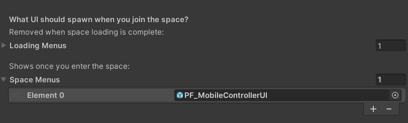

# MobileDemo

**Initial Setup** Need an account? Refer to the Getting Started guide here:

> [Getting Started – Cavrnus Documentation](https://cavrnus.atlassian.net/wiki/spaces/CSM/pages/815269466/Getting+Started)

**Important:** Before building for your target platform, make sure to follow all required project setup steps.
> Refer to the official guide here:  
> [Required Project Settings – Cavrnus Documentation](https://cavrnus.atlassian.net/wiki/spaces/CSM/pages/845381657/Required+Project+Settings)

## Overview

The `Scene_CavrnusMobileDemo` scene demonstrates how to integrate basic microphone and camera sharing into a mobile-friendly Unity UI. It’s designed for iOS and Android, and provides a simple touch-based interface that appears at runtime.

## Key Components

### PF_CavrnusSpatialConnector
This is the core prefab responsible for initializing Cavrnus spatial and media systems.

- During runtime, it automatically instantiates UI elements from the `SpaceMenus` section.

### PF_MobileControllerUI
This prefab provides the actual 2D interface used in the demo.

- Instantiated by `PF_CavrnusSpatialConnector` using the `SpaceMenus` category.
- Contains toggles and controls for:
  - Microphone & camera enable/disable
  - Microphone & Camera selection and sharing

## Requirements

- **Target Platforms:** iOS and Android
- **Permissions Required:**
  - Microphone
  - Camera

  Permissions should be accepted when starting the app on the target device.

## Build Notes

> [Detailed build notes and project settings located here](https://cavrnus.atlassian.net/wiki/spaces/CSM/pages/845381657/Required+Project+Settings)

## Notes

- The UI prefab is modular and can be reused in other scenes or setups.
- This demo is intended as a reference implementation — not a production UI.
- You can override or extend behavior by modifying the `PF_MobileControllerUI` prefab or connecting custom scripts to its controls.

## Known Limitations

- Microphone and camera access may not function reliably in the Unity Editor.
- **[Temporary]** On both iOS and Android, the video stream may appear rotated depending on the device’s orientation. This is a known issue and will be addressed in upcoming patches.

---